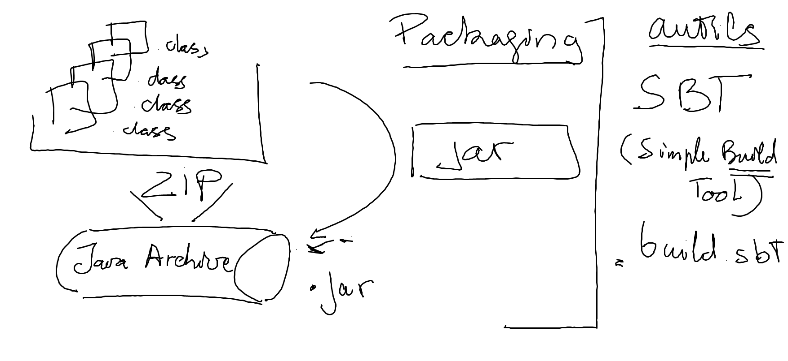

# Java

## Installation de la machine virtuelle java

* Java JDK 1.8: http://www.oracle.com/technetwork/java/javase/downloads

## Installation de l'environnement intégré de développement (IDE)

* Intellij Idea : https://www.jetbrains.com/idea/download
* Enregistrement: https://www.jetbrains.com/student/

## Installation de l'environnement de projet (build)

* sbt: http://www.scala-sbt.org/download.html

